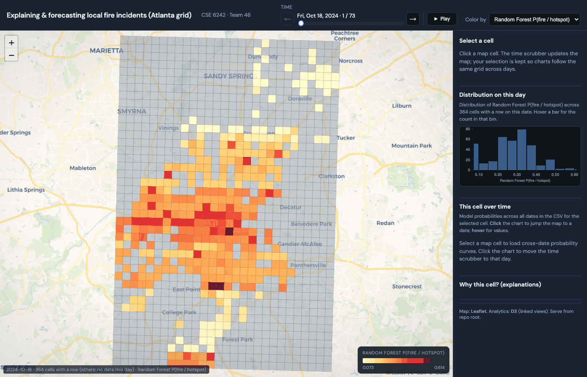

# Ignition Insights Preprocessing

This is Team 46’s CSE 6242 project pipeline: we take raw fire incidents, match them to daily weather, put everything on a fixed city grid, and end up with a table you can hand to baselines and models.

**Live visualization (GitHub Pages):** [Fire risk explorer — interactive Atlanta grid map](https://jayvenn21.github.io/cse6242group46/frontend/index.html)

## Dataset assumptions

- **Fire data:** FEMA NFIRS (or similar) — `.gpkg`, `.csv`, or `.parquet` with locations.
- **Weather:** one row per day with date, plus temperature, humidity, precipitation, and wind. The build script tries to guess column names; you can override on the command line.
- NFIRS is huge national data, so you’ll almost always want to **filter to your city** before running the heavy steps.

## Install

```bash
python3 -m pip install -r requirements.txt
```

`requirements.txt` also lists **Playwright** and **Pillow** for the optional capture script that records the map GIF for this README. If you only care about the data pipeline, you can ignore them until you need to refresh screenshots. The first time you run captures, you’ll also run `python -m playwright install chromium` once.

## Run

What we actually used in this repo (Atlanta, 2024-style handoff):

```bash
python3 scripts/fetch_nfirs_light.py \
  --state-id GA \
  --city Atlanta \
  --out data/raw/nfirs_2024_atlanta_fire.geojson

python3 scripts/fetch_weather_openmeteo.py \
  --latitude 33.7490 \
  --longitude -84.3880 \
  --start-date 2024-01-01 \
  --end-date 2024-12-31 \
  --out data/raw/atlanta_weather_2024.csv

python3 scripts/build_model_table.py \
  --incidents data/raw/nfirs_2024_atlanta_fire.geojson \
  --weather data/raw/atlanta_weather_2024.csv \
  --grid-size-m 1000 \
  --horizon-days 1 \
  --outdir data/processed
```

A more generic example (your own paths and filters):

```bash
python3 scripts/build_model_table.py \
  --incidents data/raw/nfirs_2024_all_incidents.gpkg \
  --weather data/raw/weather_daily.csv \
  --filter-field state \
  --filter-value GA \
  --filter-field city \
  --filter-value Atlanta \
  --grid-size-m 1000 \
  --horizon-days 1 \
  --outdir data/processed
```

If the auto-detect step can’t find a column, name it yourself, for example:

```bash
python3 scripts/build_model_table.py \
  --incidents data/raw/incidents.gpkg \
  --weather data/raw/weather.csv \
  --date-col incident_date \
  --lat-col latitude \
  --lon-col longitude \
  --incident-type-col incident_type \
  --weather-date-col date \
  --temp-col temperature \
  --humidity-col humidity \
  --precip-col precipitation \
  --wind-col wind_speed
```

## Outputs

By default this lands in `data/processed/`:

- `incidents_clean.parquet`
- `grid_cells.geojson`
- `cell_day_table.parquet`
- `model_table.parquet`

`model_table.parquet` is what we feed into RF, ARIMA, and the rest of the baselines.

## Run the frontend (local)
You need `baselines/outputs/model_results.csv` (and the usual `data/processed/` + interpretability files) in place first—same as for the hosted site. From the **repo root**, start a small server so the app can load data (browsers block that from `file://`):
```bash
python3 -m http.server 8000
```
Then open **http://localhost:8000/frontend/index.html** in your browser. If you only want to poke at the UI without cloning, use the [live link](https://jayvenn21.github.io/cse6242group46/frontend/index.html) at the top of this README instead.

## The map app (Leaflet + D3)

**Hosted app:** **[https://jayvenn21.github.io/cse6242group46/frontend/index.html](https://jayvenn21.github.io/cse6242group46/frontend/index.html)**

There’s a static site under `frontend/` that turns the model outputs into something you can **explore in time and space**.

### What you’re looking at

The main view is a **hex-style grid** (GeoJSON cells) laid on a light basemap. Each cell is a fixed neighborhood patch; color encodes whatever you pick in **“Color by”** for the **selected day**. The legend at the bottom of the map shows the scale (roughly yellow → deep red) and the min/max of that metric *across cells that have a model row on that day*, so the map is always comparable within the current day and metric.

You can color by several fields from `model_results.csv`, including **RF probability**, **hotspot / ARIMA model scores**, **ARIMA forecast**, **incident counts** in the interval, and the **next-interval target**—so the same grid can show “model belief” or raw outcome structure, depending on what you want to study.

The **time control** at the top is a date index (not a free calendar): it steps through the dates that actually appear in the model file. **Play** animates forward through those dates. When you move time, every view that depends on “today” updates together: the map fill, the status line under the map, the distribution plot, and (if you’ve selected a cell) the snapshot table for that day.

**Hover** a cell to see its id and the current metric value in the status strip; **click** a cell to “latch” it. The right-hand column then shows (1) a **histogram** of the chosen metric over all cells with data on that day, (2) a **small-multiple line chart** of the three model probability tracks for *that cell* across *all* dates in the CSV, and (3) a **read-only table** of key fields for that cell on the selected day. If you generated `explanations.csv`, you also get a short **narrative** and a **horizontal bar chart of top SHAP drivers** for that cell–date when a row exists. **Clicking a point** on the time-series chart jumps the global date scrubber to the nearest modeled day so the map and table stay in sync—that’s the main “linked view” gesture besides the slider.

### Quick preview

This GIF was recorded with `scripts/capture_frontend_media.py`. It’s the choropleth stepping through a few model dates with the time slider.

<p align="center">
  
</p>

## Current data choices (locked in this repo)

- **Incidents:** 2024 NFIRS PDR Light, filtered to `STATE_ID='GA'`, `CITY='Atlanta'`, fire `INC_TYPE` 100–199, and `AID` in `1`, `2`, or `N` to reduce double-counting from aid records.
- **Weather:** Open-Meteo daily history for `33.749, -84.388` — mean temp, mean RH, daily precip, and max 10 m wind.

## Scope note

Right now the table is **only** NFIRS + citywide daily weather + time/history features. We are **not** folding in 911, census, or other neighborhood context unless another part of the project adds that — don’t claim those in the writeup if they aren’t in this branch.
